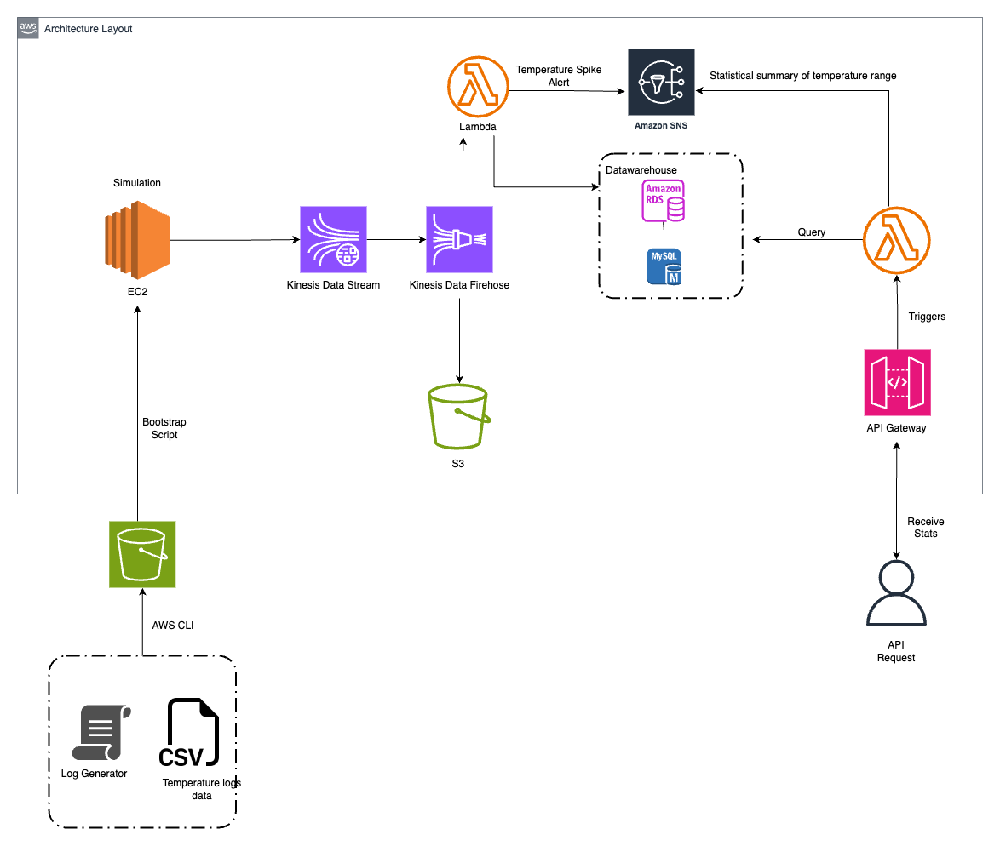

# Temperature Analysis Service - AWS Stack

## Overview

The Temperature Analysis service is a robust AWS cloud-based solution designed to process and monitor temperature data in real time. It detects anomalies, alerts stakeholders, and provides statistical analysis through a user-friendly API.

## Architecture

The architecture is serverless and event-driven, ensuring scalability and cost-efficiency:

- **EC2 Instances**: Simulate temperature data streams using the `temperature_simulation.py` script.
- **Kinesis Data Stream**: Captures the simulated temperature data for real-time processing.
- **Kinesis Data Firehose**: Batches the data and prepares it for processing.
- **Lambda Functions**: (`processor.py` and `statistics.py`) process the incoming data to detect anomalies, store the results, and calculate statistics.
- **Amazon RDS**: Stores the processed data, allowing for complex queries.
- **Amazon S3**: Holds raw data and scripts for the simulation and Lambda functions.
- **Amazon SNS**: Manages temperature spike alerts and sends notifications.
- **API Gateway**: Interfaces with Lambda to provide a RESTful API to users.

The provided `architecture.png` illustrates how each component interacts within the AWS ecosystem to deliver this service.

## Folder Structure

- **LICENSE**: Contains the license details for the project.
- **README.md**: This file, which provides project documentation.
- **aws/**:
  - `architecture.png`: The image file of the service architecture.
  - `cloud_formation.json`: CloudFormation template for deploying AWS resources.
- **data/**:
  - `IOT-temp.csv`: Sample CSV file with IoT temperature data.
- **lambda/**:
  - `processor.py`: Lambda function for processing data from Kinesis.
  - `statistics.py`: Lambda function for computing temperature statistics.
  - **zips/**: Zipped packages of Lambda functions for deployment.
    - `processor.zip`
    - `statistics.zip`
- **simulation/**:
  - `temperature_simulation.py`: Script to simulate temperature data generation.

## Deployment

The service is deployed using the `cloud_formation.json` CloudFormation template, which provisions all necessary AWS resources and configures them accordingly.

## License

This project is licensed under the [MIT License](./LICENSE) - see the file for details.
